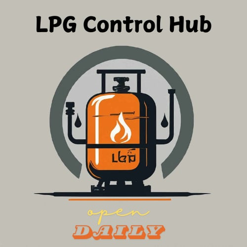

# lpg-gas-booking-system
it is a simple GUI based python project. i have created a simple interface where user can book lpg gas , track his booking records and cancel the bookings. this project is based on python language and using sql query storing the records of customers activity in the database. i have created 2 .py file , one is for booking interface and another is for appointment. you can download this zip file and simply run in jupyter notebook or spyder or anyother python interpreter.
requirements for running this system:
1) install any python notebook 
2)download this zip file
3)extract the zip file
4)open the file in python notebook
5)then run the code


                                                                                                                                ~Avinash

# SD-3101 [LPG-GAS-BOOKING-SYSTEM]



## Table of Contents
- [Introduction](#introduction)
- [Project Overview](#project-overview)
- [Objectives](#objectives)
- [Features](#features)
- [Technologies Used](#technologies-used)
- [Setup and Installation](#setup-and-installation)
- [Usage Instructions](#usage-instructions)
- [Project Structure](#project-structure)
- [Contributors](#contributors)
- [Chagelog](#changelog)
- [Acknowledgments](#acknowledgments)
- [License](#license)

---

## Introduction
The **LPG Gas Booking System** is designed to streamline and automate the process of booking LPG gas cylinders for consumers. Its purpose is to provide a convenient and efficient platform for customers to order gas refills, track their bookings, and manage deliveries. The system simplifies the traditional manual process, reducing delays, errors, and ensuring timely delivery of LPG cylinders, thereby improving customer satisfaction and operational efficiency for suppliers.

## Project Overview
## Background/Context
The LPG Gas Booking System addresses the challenges associated with manual gas cylinder booking processes, such as delays in orders, mismanagement of customer data, and difficulties in tracking deliveries. With the growing reliance on LPG for both domestic and commercial purposes, there is an increasing demand for a streamlined, digital solution that enhances the efficiency and reliability of the booking process.

## Target Audience/Users
The primary users of this system include:
- **Households and Businesses:** Individuals and organizations that depend on LPG for cooking, heating, and other energy needs.
- **LPG Suppliers and Distributors:** Entities responsible for managing customer orders, deliveries, and inventory.

## Real-World Applications/Potential Impact
The LPG Gas Booking System can be deployed by gas agencies to:
- **Automate Booking Processes:** Reduce manual errors and streamline order management.
- **Improve Customer Service:** Offer a more efficient and user-friendly service experience.
- **Enhance Resource Management:** In regions where LPG is a primary fuel source, the system can help prevent supply shortages, reduce wait times, and ensure better safety.
- **Organize Supply Chain:** Contribute to a more transparent and efficient supply chain for LPG distribution.


## Objectives

### Develop a Solution for Inefficient LPG Booking Processes
Create a digital platform to automate and simplify the process of booking LPG gas cylinders. This will address issues related to manual errors and delays in order management, providing a more efficient solution for both customers and suppliers.

### Implement Features to Enhance User Experience and Efficiency
Build and integrate key functionalities including:
- **Online Booking:** Allow users to book LPG cylinders easily through a web interface.
- **Order Tracking:** Enable customers and suppliers to track the status of their orders in real-time.
- **Delivery Scheduling:** Provide options for scheduling delivery times to suit customer convenience.
- **Payment Integration:** Facilitate secure and straightforward payment options for users.

### Test and Validate System Performance, Reliability, and Scalability
- **System Testing:** Conduct thorough testing to ensure the platform can handle high volumes of bookings without performance issues.
- **Data Validation:** Validate accuracy of data and transactions within the system.
- **Scalability Assessment:** Evaluate the system’s ability to scale and perform efficiently under increased load and in different deployment scenarios.


## Features
Here are some key features of the LPG Control Hub: 

Admin-side:

•	Dashboard: Displays an overview of LPG consumption, system status, and real-time alerts. It shows total usage, current operational status, and key performance metrics.

•	Device Management: Manages and configures LPG devices, including status checks, maintenance scheduling, and device settings.

•	User Management: Handles user accounts, roles, and permissions, and tracks user activity for security and auditing.

•	Alerts and Notifications: Manages and reviews system alerts, incidents, and notification settings.

•	Reporting and Analytics: Generates detailed reports on gas consumption, compliance, and system performance.

•	System Settings: Adjusts global system settings, manages backups, and schedules updates.

User-side:

•	Dashboard: Provides an overview of individual LPG consumption, current system status, and key alerts.

•	Alerts and Notifications: Displays active alerts and allows users to adjust notification preferences.

•	Usage History: Shows historical data on LPG consumption and past incidents.

•	System Control: Allows for manual control of LPG devices and access to emergency shutdown procedures.

•	Maintenance Requests: Enables users to submit and track maintenance requests for LPG systems.

•	User Profile: Manages personal details, login activity, and security settings.

•	Educational Resources: Offers access to safety guidelines and training materials related to LPG management.


## Technologies Used
Mention the tools, frameworks, and technologies used in the project:
- Programming Languages: Python
- Frameworks/Libraries: tkinter
- Databases: sqlite3
- Other Tools: Git, VScode

## Setup and Installation
Step-by-step instructions for setting up the project locally.

1. **Clone the repository:**
   ```bash
   git clone https://github.com/thebadsektor/se2024-antido-de-lima
   ```
2. **Install dependencies:**
   - If using `npm`:
   ```bash
   git clone https://github.com/thebadsektor/se2024-antido-de-lima
   ```
   - If using `pip` (for Python projects):
   ```bash
   git clone https://github.com/thebadsektor/se2024-antido-de-lima
   ```
3. **Configure environment variables (if any)**: Provide instructions for setting up .env files or any other required configurations.
   ```bash
   git clone https://github.com/thebadsektor/se2024-antido-de-lima
   ```
4. **Run the project:**
   - For web projects:
   ```bash
   npm start
   ```
   - IFor backend services:
   ```bash
   python app.py
   ```

**Note:** If your project has external depencies like XAMPP, MySQL, special SDK, or other environemnt setup, create another section for it.

## Usage Instructions
Provide detailed instructions on how to use the project after setup:
- How to access the application.
- Example commands or API calls (if applicable).
- Databases: [e.g., MySQL, MongoDB, etc.]
- Screenshots or GIFs showcasing key functionalities (optional).


Another Screenshot


## Project Structure
C:
└── Users
    └── Admi1
        └── se2024-antido-de-lima
            ├── .gitignore
            ├── appointment.py
            ├── banner.jpg
            ├── booking.py
            ├── database.db
            ├── LICENSE
            └── README.md

## Contributors

List all the team members involved in the project. Include their roles and responsibilities:

- **Kennard De Lima**: Lead Developer, Backend Developer
- **Richelle Antido**: Frontend Developer, UI/UX Designer
- **Gerald Villaran**: Project Manager, Tester

## Project Timeline

Outline the project timeline, including milestones or deliverables. Example:

- **Week 1-2**: Research and project planning.
- **Week 3-5**: Design and setup.
- **Week 6-10**: Implementation.
- **Week 11-12**: Testing and debugging.
- **Week 13-14**: Final presentation and documentation.

## Changelog

### -no content


## Acknowledgments

Acknowledge any resources, mentors, or external tools that helped in completing the project.

This project was built from [lpg-gas-booking-system] (https://github.com/CoderAvi), created by Avinash Kumar!. You can view the original repository [here](https://github.com/CoderAvi/lpg-gas-booking-system?tab=readme-ov-file).

## License

Specify the project's license. For starters, adapt the license of the original repository.

Apache License
                           Version 2.0, January 2004
                        http://www.apache.org/licenses/

   Licensed under the Apache License, Version 2.0 (the "License");
   you may not use this file except in compliance with the License.
   You may obtain a copy of the License at

       http://www.apache.org/licenses/LICENSE-2.0

   Unless required by applicable law or agreed to in writing, software
   distributed under the License is distributed on an "AS IS" BASIS,
   WITHOUT WARRANTIES OR CONDITIONS OF ANY KIND, either express or implied.
   See the License for the specific language governing permissions and
   limitations under the License.

# se2024-antido-de-lima
# se2024-antido-de-lima
